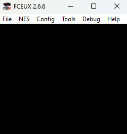
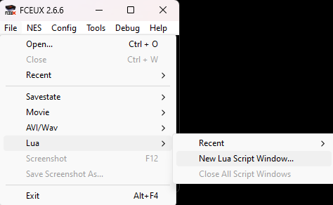
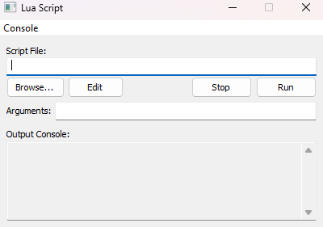

## Lua Script of an Autonomous Bomberman Player

The idea of this project is to create an autonomous player to [Bomberman](https://en.wikipedia.org/wiki/Bomberman_(1983_video_game)). To make this I use Lua script to create an AI to play the game, using the [FCEUX](https://fceux.com/web/home.html) Emulator.

The `bfs_bot_bomberman_nes.lua` uses a breadth-first search to play the game.

The `a_star_bot_bomberman_nes.lua` uses a a* search to play the game.

The purpose of this project is show the a* method is better than the breasth-first search in this case. Using the FPS from the game to prove this.

## Requirements

To use this scripts you need the [FCEUX](https://fceux.com/web/home.html) Emulator and the game 'Bomberman' from NES.

Create a folder named 'ROMs' and place the game file there.

Rename the file to 'Bomberman (U).nes'.

## Step-by-step

#### 1 - Open the FCEUX.

#### 2 - Click on 'File' -> 'Lua' -> 'New Lua Script Window...'.

#### 3 - Click on 'Browse'.

#### 4 - Choose one of archives, the BFS Bot or A* Bot.

#### 5 - Click on 'Run' and it will make the rest.

#### 6 - Enjoy.

---

* Author: Gustavo Henrique Alves Rocha
* GitHub: https://github.com/ghuswes

---

## Extra Content

### To understand the code:
    global variable are defined by -> GLOBAL_VARIABLE
    local variable are defined by  -> local_variable
    functions are defined by       -> exampleFunction

If you wanna know the meaning of the values and variables used on this game I will show some of the most importants here.

---

### Stage Specs
| Address | Description |
|-|-|
| 0x0093 | Stage Time Remaining |
| 0x0200 | First Tile |
| 0x041F | Last Tile |
| 0x0058 | Current Stage |
| 0x0060 | Boolean To Indicate the Stage Start Up |

---

### Player Specs
| Address | Description |
|-|-|
| 0x0028 | Coordinate X of the player |
| 0x002A | Coordinate Y of the player |
| 0x0068 | Lifes Remaining |
| 0x0073 | Bomb Power Level (x16) |
| 0x0074 | Bombs in Bag |
| 0x0075 | Player Speed (0-1) |
| 0x0076 | Ability to Trespass Walls (0-1) |
| 0x0077 | Ability to Detonate Bomb Using B Button (0-1) |
| 0x0078 | Ability to Trespass Bombs (0-1) |
| 0x0079 | Ability to Fireproof (0-1) |

---

### Bomb Specs
| Address | Description |
|-|-|
| 0x0431 |  animation of explosion, use to stay safe |
| 0x0434 |  animation of explosion, use to grant security |
| 0x0435 |  animation of explosion, use to grat security twice |

| BOMBS | Boolean Address | Coord X Address | Coord Y Address |
|-------|----------------|---------|---------|
| BOMB 1 | 0x03A0 | 0x03AA | 0x03B4 |
| BOMB 2 | 0x03A1 | 0x03AB | 0x03B5 |
| BOMB 3 | 0x03A2 | 0x03AC | 0x03B6 |
| BOMB 4 | 0x03A3 | 0x03AD | 0x03B7 |
| BOMB 5 | 0x03A4 | 0x03AE | 0x03B8 |
| BOMB 6 | 0x03A5 | 0x03AF | 0x03B9 |
| BOMB 7 | 0x03A6 | 0x03B0 | 0x03BA |
| BOMB 8 | 0x03A7 | 0x03B1 | 0x03BB |
| BOMB 9 | 0x03A8 | 0x03B2 | 0x03BC |
| BOMB 10 | 0x03A9 | 0x03B3 | 0x03BD |

---

### Enemies
| Address | Description |
|-|-|
| 0x009C |  Quantity of Enemies Remaining on Current Stage |
| 0x009E |  Quantity of Enemies Defeated on Current Stage |

| Enemy | Enemy Type Address | Coord X Address | Coord Y Address |
|-|-|-|-|
| Enemy 1 | 0x0576 | 0x0580 | 0x0594 | 
| Enemy 2 | 0x0577 | 0x0581 | 0x0595 | 
| Enemy 3 | 0x0578 | 0x0582 | 0x0596 | 
| Enemy 4 | 0x0579 | 0x0583 | 0x0597 | 
| Enemy 5 | 0x057A | 0x0584 | 0x0598 | 
| Enemy 6 | 0x057B | 0x0585 | 0x0599 | 
| Enemy 7 | 0x057C | 0x0586 | 0x059A | 
| Enemy 8 | 0x057D | 0x0587 | 0x059B | 
| Enemy 9 | 0x057E | 0x0588 | 0x059C | 
| Enemy 10 | 0x057F | 0x0589 | 0x059D | 

##### Enemy List:
 * Type 1: Ballom
 * Type 2: Onil
 * Type 3: Dahl
 * Type 4: Minvo
 * Type 5: Doria
 * Type 6: Ovape
 * Type 7: Pass
 * Type 8: Pontan

---

### Stage Tiles Address
| × | 1 | 2 | 3 | 4 | 5 | 6 | 7 | 8 | 9 | 10 | 11 | 12 | 13 | 14 | 15 | 16 | 17 | 18 | 19 | 20 | 21 | 22 | 23 | 24 | 25 | 26 | 27 | 28 | 29 | 30 | 31 | 32 |
|:---:|-|-|-|-|-|-|-|-|-|-|-|-|-|-|-|-|-|-|-|-|-|-|-|-|-|-|-|-|-|-|-|-|
| **1** | 200 | 201 | 202 | 203 | 204 | 205 | 206 | 207 | 208 | 209 | 20A | 20B | 20C | 20D | 20E | 20F | 210 | 211 | 212 | 213 | 214 | 215 | 216 | 217 | 218 | 219 | 21A | 21B | 21C | 21D | 21E | 21F | 
|  **2** | 220 | 221 | 222 | 223 | 224 | 225 | 226 | 227 | 228 | 229 | 22A | 22B | 22C | 22D | 223 | 22F | 230 | 231 | 232 | 233 | 234 | 235 | 236 | 237 | 238 | 239 | 23A | 23B | 23C | 23D | 23E | 23F | 
|  **3** | 240 | 241 | 242 | 243 | 244 | 245 | 246 | 247 | 248 | 249 | 24A | 24B | 24C | 24D | 24E | 24F | 250 | 251 | 252 | 253 | 254 | 255 | 256 | 257 | 258 | 259 | 25A | 25B | 25C | 25D | 25E | 25F | 
|  **4** | 260 | 261 | 262 | 263 | 264 | 265 | 266 | 267 | 268 | 269 | 26A | 26B | 26C | 26D | 26E | 26F | 270 | 271 | 272 | 273 | 274 | 275 | 276 | 277 | 278 | 279 | 27A | 27B | 27C | 27D | 27E | 27F | 
|  **5** | 280 | 281 | 282 | 283 | 284 | 285 | 286 | 287 | 288 | 289 | 28A | 28B | 28C | 28D | 28E | 28F | 290 | 291 | 292 | 293 | 294 | 295 | 296 | 297 | 298 | 299 | 29A | 29B | 29C | 29D | 29E | 29F | 
|  **6** | 2A0 | 2A1 | 2A2 | 2A3 | 2A4 | 2A5 | 2A6 | 2A7 | 2A8 | 2A9 | 2AA | 2AB | 2AC | 2AD | 2AE | 2AF | 2B0 | 2B1 | 2B2 | 2B3 | 2B4 | 2B5 | 2B6 | 2B7 | 2B8 | 2B9 | 2BA | 2BB | 2BC | 2BD | 2BE | 2BF | 
|  **7** | 2C0 | 2C1 | 2C2 | 2C3 | 2C4 | 2C5 | 2C6 | 2C7 | 2C8 | 2C9 | 2CA | 2CB | 2CC | 2CD | 2CE | 2CF | 2D0 | 2D1 | 2D2 | 2D3 | 2D4 | 2D5 | 2D6 | 2D7 | 2D8 | 2D9 | 2DA | 2DB | 2DC | 2DD | 2DE | 2DF | 
|  **8** | 2E0 | 2E1 | 2E2 | 2E3 | 2E4 | 2E5 | 2E6 | 2E7 | 2E8 | 2E9 | 2EA | 2EB | 2EC | 2ED | 2EE | 2EF | 2F0 | 2F1 | 2F2 | 2F3 | 2F4 | 2F5 | 2F6 | 2F7 | 2F8 | 2F9 | 2FA | 2FB | 2FC | 2FD | 2FE | 2FF | 
|  **9** | 300 | 301 | 302 | 303 | 304 | 305 | 306 | 307 | 308 | 309 | 30A | 30B | 30C | 30D | 30E | 30F | 310 | 311 | 312 | 313 | 314 | 315 | 316 | 317 | 318 | 319 | 31A | 31B | 31C | 31D | 31E | 31F | 
|  **10** | 320 | 321 | 322 | 323 | 324 | 325 | 326 | 327 | 328 | 329 | 32A | 32B | 32C | 32D | 32E | 32F | 330 | 331 | 332 | 333 | 334 | 335 | 336 | 337 | 338 | 339 | 33A | 33B | 33C | 33D | 33E | 33F | 
| **11** | 340 | 341 | 342 | 343 | 344 | 345 | 346 | 347 | 348 | 349 | 34A | 34B | 34C | 34D | 34E | 34F | 350 | 351 | 352 | 353 | 354 | 355 | 356 | 357 | 358 | 359 | 35A | 35B | 35C | 35D | 35E | 35F | 
|  **12** | 360 | 361 | 362 | 363 | 364 | 365 | 366 | 367 | 368 | 369 | 36A | 36B | 36C | 36D | 36E | 36F | 370 | 371 | 372 | 373 | 374 | 375 | 376 | 377 | 378 | 379 | 37A | 37B | 37C | 37D | 37E | 37F | 
|  **13** | 380 | 381 | 382 | 383 | 384 | 385 | 386 | 387 | 388 | 389 | 38A | 38B | 38C | 38D | 38E | 38F | 390 | 391 | 392 | 393 | 394 | 395 | 396 | 397 | 398 | 399 | 39A | 39B | 39C | 39D | 39E | 39F | 

##### Possibly Tile Values:
* Empty: 0
* Concrete: 1
* Brick: 2
* Bomb: 3
* Hidden Exit: 4
* Hidden Bonus: 5
* Bonus: 6
* Exit: 8

---

##### Note: if you wanna see the importat addresses in gaming running time, the archive `Bomberman (U).wch` can be opened in the FCEUX Emulator, go to "Tools->RAM Watch...", on the new windows go to "File->Open..." and choose the file `Bomberman (U).wch`. Now you can see some of addresses that I separated to help me on the code debugging.

[Link to video showing the first stage played by each method.](https://youtu.be/y2MwHsKfFTY)
